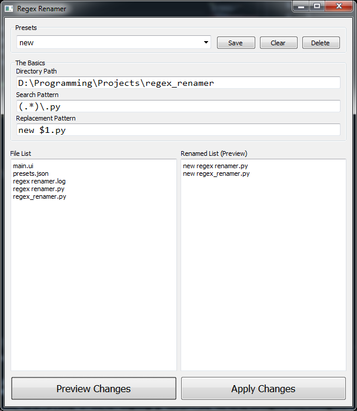

# Regex File Renamer
Allows you to use regex to rename files in a directory, with dollar-number notation to insert capture groups (see screenshot below).

## Basic usage
- If `Directory Path` exists, it will display all the files in that directory under the `File List` text box
- It will probably be helpful to use a site like [regex101](https://regex101.com/) to help troubleshoot regex errors
- If no filenames match the `Search Pattern` then the preview listing will display `No files matched search criteria!`
- The `Preview Changes` button does exactly what it says
- Only the files that match the `Search Pattern` will be renamed
 
## Presets
- Presets are saved to `presets.json` in the root directory
- `Save` will write the current patterns to a preset with the name currently in the combo box
- `Clear` will simply clear the pattern and preset fields, but will not changes `presets.json`
- `Delete` will delete the preset with the exact same name as the one in the combo box (if it exists)
- Manually deleting the preset name in the combo box will also clear both pattern fields

## Changelog
- v1.0
    - Initial Release